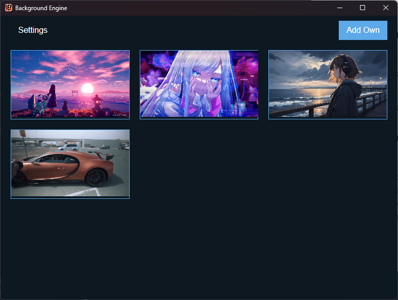
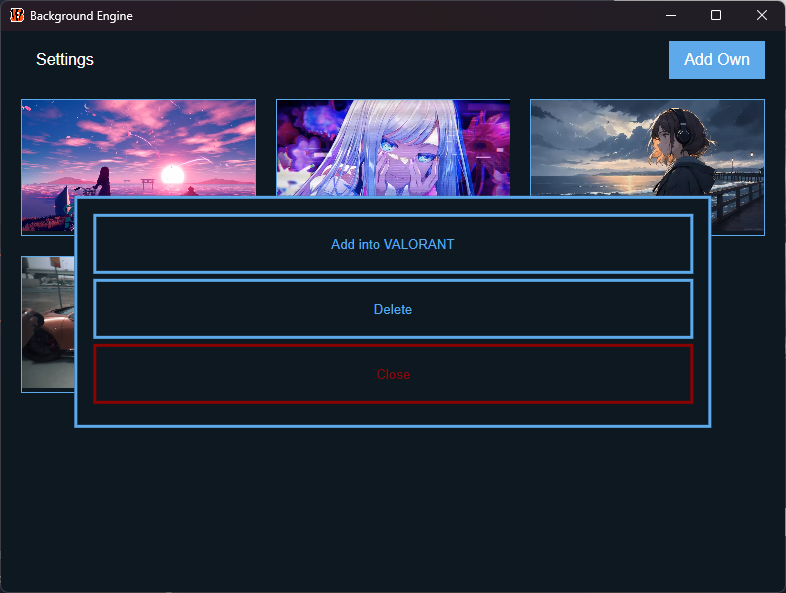
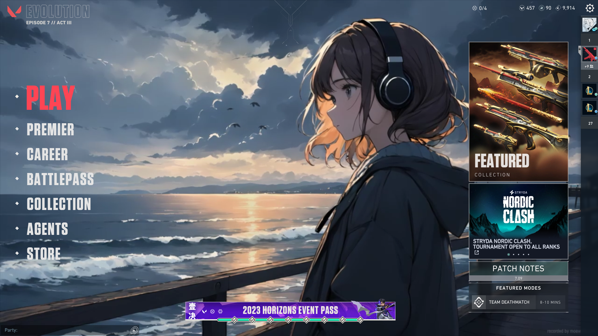

# Background Engine

## Overview

Welcome to the Background Engine! This application allows users to seamlessly change in-game backgrounds for a more personalized gaming experience.


## Screenshots





## How to Use

1. Download and install the Background Engine.
2. Launch the application.
3. Set valorant path in settings tab. It will be ```C:\Riot Games\VALORANT``` for most people
4. Click save to apply changes.
5. In home page click on image and then click on "Add to X" button.
6. Now image should be applied. Restart game to see the changes.

## Adding Backgrounds
#### Automatic
You can import backgrounds from .mp4 links, we're working on adding more options like yt and images.

To import mp4 link:
1. Open home tab in Background Engine.
2. Click on "Add Own" button.
3. Paste URL and click "Download".
4. Wait till it downloads and refreshes.
5. It sometimes does't show it immediately, in those cases press ```CTRL + R```

#### Manual
You can manually put mp4 videos into Background Engine's folder

Background Engine stores videos in: ```%appdata%\BackgroundEngineData\videos```

After putting your backgrounds into the folder press ```CTRL + R``` and it will show the newly added wallpapers


## Supported Games

- [x] Valorant
- [ ] CS2

Feel free to request support for additional games by submitting an issue or contributing to the project.

## Additional info

Background Engine runs in background, this is because some games like VALORANT check file integrity on start, so it removes the custom background. Background engine checks if it was removed and re-inserts it again.

Video audio doesn't work.


## License

This project is licensed under the [GNU GPL-3 License](LICENSE).

## TODO

### Features

- [ ] Support for additional games.
- [ ] Add an option to reset to default backgrounds.
- [ ] Add an option to download YT Videos and use still images.

### Bug Fixes

- [ ] Fix changing background causes riot client to show update.


## Disclaimer

Use this application at your own risk. While there are no known instances of bans related to using this tool, it's important to note that modifying game files is against the terms of service (TOS) of many games. Be aware of the potential risks, and use the Background Engine responsibly.

## Support and Feedback

If you encounter any issues or have suggestions for improvement, please create an [issue](https://github.com/yourusername/game-background-changer/issues).

Happy gaming! 🎮